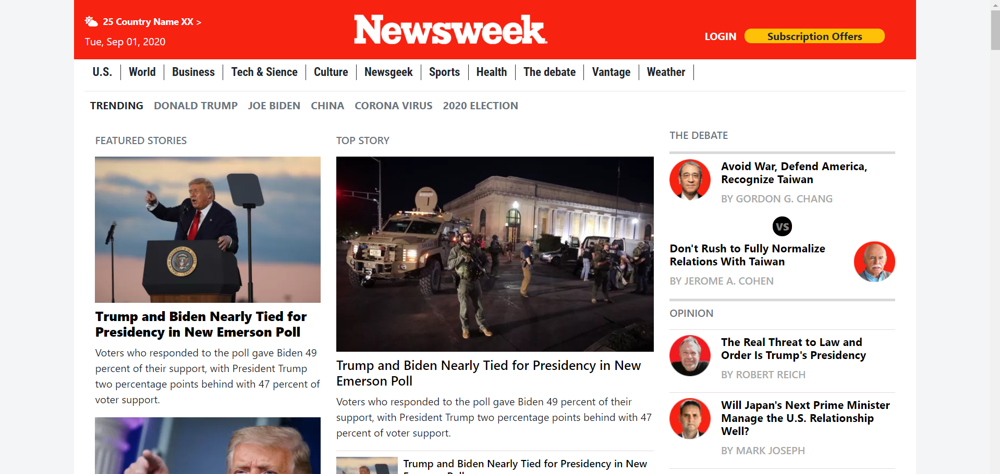

## Building with Responsive Design

</h1>This project is a clone of The News week website ( www.newsweek.com ).It's responsive to tablet view (breakpoint at 990px)

The webpage is built using html/css and bootstrap 4 classes and positioning technologies ( FLEX GRID FLOAT ).</h1>

## Built With

Html

CSS

Bootstrap

Visual code

## Live Demo

[Live Demo Link](https://elastic-jackson-c78082.netlify.app/)

## Prerequisites

Text editor,Github profile and Git.

## Authors

👤 Khalil Hamdi

- Github: [@khalilhamdii](https://github.com/khalilhamdii)

- LinkedIn: [LinkedIn](https://www.linkedin.com/in/khalilhamdi/)

👤 Sinework

- Github: [@sinework](https://github.com/sinework)

- LinkedIn: [LinkedIn](https://www.linkedin.com/in/sinework-amare-731a6a125/)

## 🤝 Contributing

Contributions, issues and feature requests are welcome!

Feel free to check the issues page.

Show your support

Give a ⭐️ if you like this project!

## 📝 License

This project is a collaboration project of microverse students. All rights are reserved for

Khalil and Sinework.
